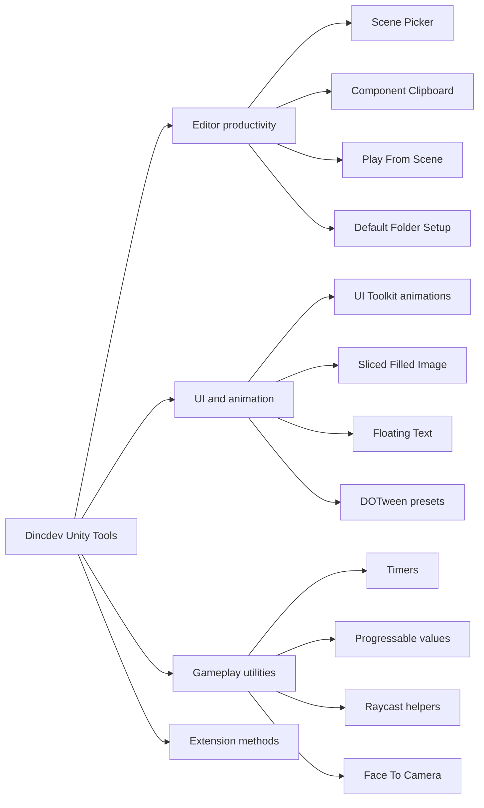
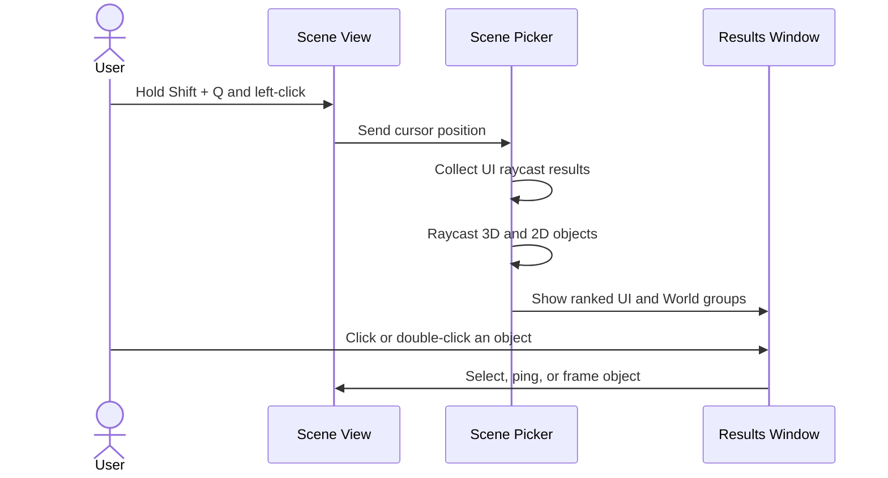
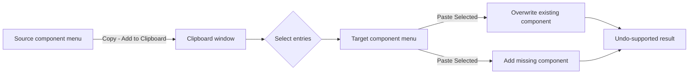

# Dincdev Unity Tools

[](https://unity.com/)
[](https://docs.unity3d.com/Manual/upm-ui-giturl.html)
[](LICENSE)
[](Packages/com.dincdev.tools/package.json)

A personal Unity Package Manager collection of editor productivity tools, UI helpers, animation utilities, and reusable gameplay building blocks.

> The package is currently in preview and is primarily maintained for use across Dincdev projects.

## At a glance



## Features

| Area | Tool | What it does |
| --- | --- | --- |
| Editor | **Scene Picker** | Finds every UI and world object under the cursor and presents the results as a searchable hierarchy. |
| Editor | **Component Clipboard** | Copies multiple component snapshots, previews their values, and pastes the selected components onto another GameObject with Undo support. |
| Editor | **Play From Scene** | Adds a scene dropdown to the Unity toolbar and starts Play Mode from the selected enabled build scene. |
| Editor | **Default Folder Setup** | Creates a conventional project folder structure and useful hierarchy roots in one click. |
| UI | **Sliced Filled Image** | Provides a `MaskableGraphic` that combines sliced sprites with directional fill behavior. |
| UI Toolkit | **Animation Extensions** | Reveal, slide, pulse, shake, flash, count-up, stagger, and fly-to-position effects for `VisualElement` objects. |
| Animation | **DOTween Utilities** | Reusable entrance, scale, bounce, movement, smoke, and floating damage-text animations. |
| Gameplay | **Timer / Progressable** | Lightweight countdown, stopwatch, normalized progress, and cancellable async interpolation helpers. |
| Gameplay | **Raycast Helpers** | Performs downward raycasts and returns a requested component type. |
| General | **Extension Methods** | Transform reset, vector editing, component traversal, formatting, hashing, colored logs, UI positioning, and more. |

## Installation

### Unity Package Manager

1. Open **Window > Package Manager**.
2. Select **+ > Add package from git URL...**.
3. Paste the following URL:

```text
https://github.com/Dogukaninc/Dincdev_Unity_Packages.git?path=/Packages/com.dincdev.tools
```

### `manifest.json`

Alternatively, add the package directly to your project's `Packages/manifest.json`:

```json
{
  "dependencies": {
    "com.dincdev.tools": "https://github.com/Dogukaninc/Dincdev_Unity_Packages.git?path=/Packages/com.dincdev.tools"
  }
}
```

Pinning a release or commit is recommended for production projects:

```text
https://github.com/Dogukaninc/Dincdev_Unity_Packages.git?path=/Packages/com.dincdev.tools#<tag-or-commit>
```

## Requirements

- Unity **2021.3 or newer**, as declared by the package manifest. Some editor APIs used by the current package may require a newer Unity release; the repository itself is developed with Unity **6000.3.10f1**.
- [UniTask](https://github.com/Cysharp/UniTask) for asynchronous progress and UI animations.
- [DOTween](https://dotween.demigiant.com/) for tween presets and floating text.
- TextMeshPro for floating text.
- [Odin Inspector](https://odininspector.com/) for the `FaceToCamera` inspector attributes.
- Unity UI (`com.unity.ugui`) and UI Toolkit.

These third-party dependencies are referenced by source code but are not currently declared in the package's `package.json`. Install them in the consuming project before importing this package.

## Editor tools

### Scene Picker

Scene Picker makes selecting overlapping objects in a busy scene much easier. It collects both UI and world-space candidates under the mouse, ranks them, and displays them in a searchable tree.



**Default shortcut:** hold `Shift + Q`, then left-click in the Scene view.

- Single-click a result to select and ping it.
- Double-click a result to select and frame it.
- Search by hierarchy name or component descriptor.
- Change the shortcut from **Flickle > Scene Picker Shortcut**.

### Component Clipboard

Component Clipboard lets you build a temporary list of component snapshots from one or more source objects and paste selected entries onto a target.



1. Open **Tools > Component Clipboard**.
2. Open a component's context menu and choose **Copy → Add to Clipboard**.
3. Select the entries you want in the clipboard window.
4. Open a component context menu on the target GameObject and choose **Paste Selected From Clipboard**.

Entries are grouped by source GameObject. Existing components are overwritten; missing components are added when Unity permits it. Clipboard contents live in editor memory and are cleared after a domain reload or editor restart.

### Play From Scene

The toolbar scene dropdown lists enabled scenes from Build Settings. Select one to make it the Play Mode start scene. Select **Current Active Scene** to restore Unity's default behavior.

```text
Unity Toolbar
┌──────────────────────────────────────────────────────────────┐
│  Scene: MainMenu ▼       ▶  ▌▌  ■                           │
└──────────────────────────────────────────────────────────────┘
           │
           ├─ Current Active Scene
           ├─ Bootstrap
           ├─ MainMenu
           └─ Gameplay
```

The selection is stored in `EditorPrefs`. Choosing a scene outside Play Mode also offers to save modified scenes before opening it.

### Default project structure

Run **Tools > Create Default Folders** to generate:

```text
Assets/
├── _Main/
│   ├── Scripts/
│   │   ├── Player/
│   │   ├── Managers/
│   │   ├── Operations/
│   │   ├── UI/
│   │   └── Prefabs/
│   └── Art/
│       ├── SFX/
│       ├── Models/
│       ├── Prefabs/
│       ├── UI/
│       ├── Materials/
│       ├── Textures/
│       └── Animations/
├── Scripts/
└── Art/
```

It also creates three root GameObjects in the active scene: `--SETUP--`, `--HANDLERS--`, and `--ENVIRONMENT--`.

## Runtime utilities

### Timers

`CountdownTimer` and `StopwatchTimer` are plain C# objects. Tick them from the update loop of your choice.

```csharp
private readonly CountdownTimer cooldown = new(5f);

private void Start()
{
    cooldown.OnTimerStop += () => Debug.Log("Cooldown complete");
    cooldown.Start();
}

private void Update()
{
    cooldown.Tick(UnityEngine.Time.deltaTime);
}
```

### Progressable values

`Progressable` stores a clamped `0..1` value and supports immediate updates, ticking by speed, or cancellable UniTask interpolation.

```csharp
using _Main.Project.Scripts.Utils;

private readonly Progressable healthBar = new(initialValue: 1f);

private async UniTask TakeDamageAsync()
{
    await healthBar.AnimateTo(
        target: 0.35f,
        duration: 0.4f,
        onValueChanged: value => healthFill.style.width = Length.Percent(value * 100f));
}
```

Call `CancelAnimation()` or `Dispose()` when the owning object's lifetime ends.

### UI Toolkit animation extensions

The `UIToolkitExtentions` class adds a collection of async and fire-and-forget effects directly to `VisualElement` objects.

```csharp
panel.PrepareRevealAnimation();
await panel.RevealAnimation();

await scoreLabel.CountUpLabel(
    fromValue: 0,
    targetValue: 2500,
    formatter: value => Mathf.RoundToInt(value).ToString("N0"),
    durationMs: 700);

await rewardIcon.FlyToPositionArc(
    startOffsetPx: new Vector2(-180f, 80f),
    durationMs: 600);
```

Available effects include reveal and staggered sequences, slides, pulses, scaling, shake, tilt, color flashes, numeric count-up, curved fly-to-position animation, and popup/chain overlay transitions.

### Sliced Filled Image

`SlicedFilledImage` is a custom uGUI `MaskableGraphic` for progress bars that must preserve sliced borders while filling horizontally or vertically.

```text
Right fill                         Up fill
┌──────────────────────┐          ┌──────────┐
│████████████░░░░░░░░░░│          │░░░░░░░░░░│
└──────────────────────┘          │██████████│
                                  │██████████│
                                  └──────────┘
```

Supported fill directions are `Right`, `Left`, `Up`, and `Down`. A custom inspector exposes the component settings.

### DOTween and floating text

`DoTweenUtility` and `TweenAnimationSequences` provide reusable scale, bounce, movement, smoke, and entrance presets. `DamageText` builds on these helpers to display randomized damage, critical-hit, and healing feedback with TextMeshPro.

### Other helpers

| Type | Highlights |
| --- | --- |
| `GetComponentUtils` | Depth-limited parent and recursive child component searches. |
| `RaycastProviderUtility` | Downward 3D raycasts with optional `LayerMask` filtering. |
| `FaceToCamera` | Camera-facing objects with independently frozen rotation axes. |
| `Extensions` | Compact number/time formatting, SHA-256 strings, stable scene/object IDs, rich-text colors, vector conversion, and random offsets. |
| `ExtensionMethods` | UI Toolkit/world coordinate conversion, alignment, screen clamping, aspect ratio, and localized dropdown updates. |
| `Vector3Extensions` | Creates a copy of a vector with selected axes replaced via `With(...)`. |
| `GameObjectExtensions` | Converts destroyed Unity object references to ordinary `null` via `OrNull()`. |
| `ColorBlendUtility` | Cancellable frame-by-frame float interpolation using UniTask. |
| `ColorSettings` | ScriptableObject color palette and team texture references. |

## Package layout

```text
Packages/com.dincdev.tools/
├── Editor/                    # Scene selection, menus, custom inspectors
├── Scripts/
│   ├── ComponentClipBoard/    # Clipboard and toolbar integrations
│   ├── FloatingText/          # TMP + DOTween feedback text
│   ├── TweenAnimationUtility/ # Reusable DOTween sequences
│   └── *.cs                   # Runtime utilities and extensions
├── dincdev.tools.asmdef
└── package.json
```

## Development

This repository is also a Unity project. Open the repository folder in Unity to load `Packages/com.dincdev.tools` as an embedded package. Changes made inside the package are compiled directly, so no reinstall is required during development.

When adding a public feature:

1. Keep runtime code free of `UnityEditor` references.
2. Place editor-only code under `Editor/` or an editor-only assembly definition.
3. Update `package.json` when adding a package dependency.
4. Add a focused example to this README.
5. Test both the repository project and a clean consuming project.

## License

Licensed under the [Apache License 2.0](LICENSE).
